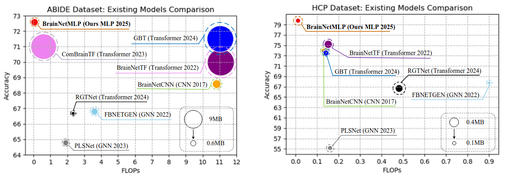
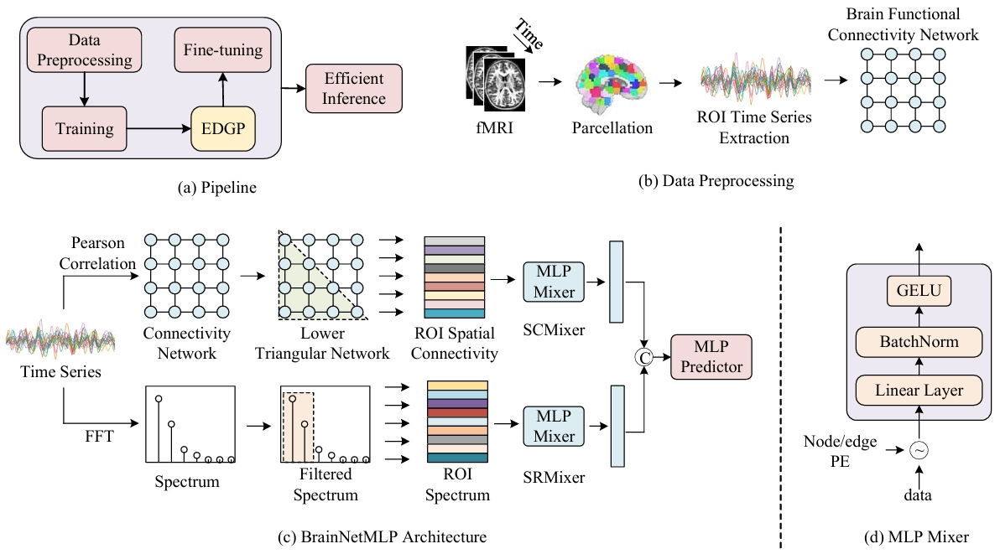

<h1 align="center">BrainNetMLP</h1>


<p align="center">
  <a href="https://arxiv.org/pdf/2505.11538"></a>
  &nbsp;
  <a href="https://github.com/JayceonHo/BrainNetMLP"></a>
  &nbsp;
  <a href="https://www.nitrc.org/"></a>
</p>

---

📢 **BrainNetMLP** is accepted for *oral presentation* at the 1st MICCAI Workshop on Efficient Medical AI.

In this project, we build a **very simple** yet efficient and effective pure MLP-based model for functional brain network classification, 
which achieves comparative performance for Autism Spectral Disorder (ASD) and gender classification.



## Pipeline



The main nolvety of BrainNetMLP is that it incorporates a dual-branch structure to jointly capture both spatial connectivity and spectral information, 
enabling precise spatiotemporal feature fusion.  


## Usage
Here, we provide the guideline for running the training and evaluation code on ABIDE dataset:

1. Prepare the data and save it at path: *full_data*.
2. The format of dataset is *.npy* by default (or you can download ABIDE dataset [here](https://drive.google.com/file/d/14UGsikYH_SQ-d_GvY2Um2oEHw3WNxDY3/view?usp=sharing)).
3. Run the following command for training and evaluation.
```bash
python train.py -d abide
```
For training and inference on other datasets, you can prepare the dataset like the format of ABIDE dataset.

## Acknowledgement
Thanks for the work of [BrainNetTF](https://github.com/Wayfear/BrainNetworkTransformer/), [ComBrainTF](https://github.com/ubc-tea/Com-BrainTF), [STGCN](https://github.com/sgadgil6/cnslab_fmri), [GBT](https://github.com/CUHK-AIM-Group/GBT) and so on, for the open-source spirit!

## Citation

If you find this project is helpful, please star the repository and cite our paper:

```bibtex
@article{hou2025brainnetmlp,
  title={BrainNetMLP: An Efficient and Effective Baseline for Functional Brain Network Classification},
  author={Hou, Jiacheng and Song, Zhenjie and Kuruoglu, Ercan Engin},
  journal={arXiv preprint arXiv:2505.11538},
  year={2025}
}
