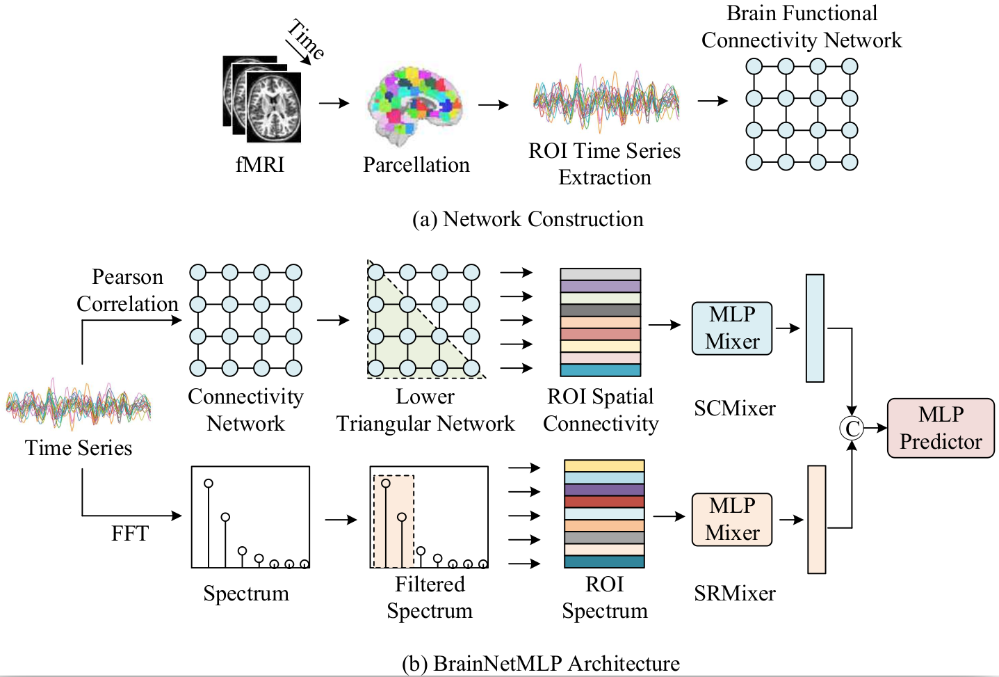

# BrainNetMLP
In this paper, we revisit the simplest deep learning architecture, the Multi-Layer Perceptron (MLP), 
and propose a pure MLP-based method, named *BrainNetMLP*, for functional brain network classification, 
which capitalizes on the advantages of MLP, including efficient computation and fewer parameters.

# Pipeline

BrainNetMLP incorporates a dual-branch structure to jointly capture both spatial connectivity and spectral information, 
enabling precise spatiotemporal feature fusion.  